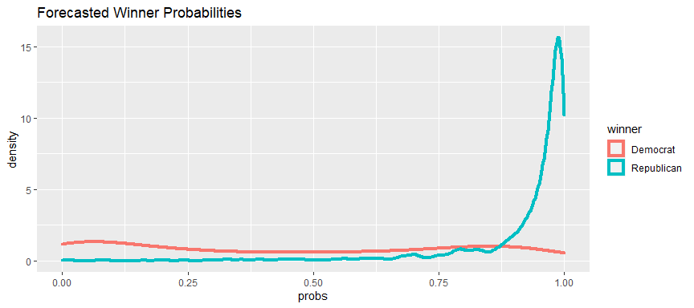
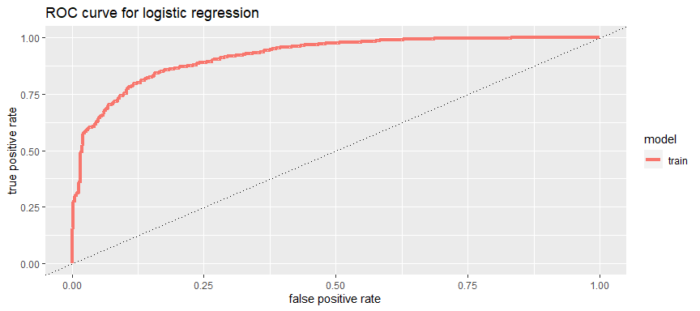

Team Project 2
================
Abizer and Luis
Day 17

This code chunk ensures that there are no commands in output file

Download the packages

Read the key file

Create the train and test dataframes

Define a winner variable, which is based on winner16 variable. Winner is
set as Democrat if winner16 is Dem and Republican if winner16 is Rep

We chose the x-variables by determining which variables were most
significant using a regression analysis. We then removed certain
variables such as Percent living in multi unit housing and percent
living in same house for multiple years. Our reasoning is that if a
house has a high median value, the occupants will probably have separate
rooms. Also any person may choose to live in a house for several years
because it might be closer to work, family etc. We don’t think that it
suggests anything about the voter.

percent_change_in_pop, , percent_change_in_pop

    Call:
    glm(formula = myform, family = binomial, data = Train1)

    Deviance Residuals: 
        Min       1Q   Median       3Q      Max  
    -3.0933   0.1303   0.2326   0.3772   3.5282  

    Coefficients:
                                                  Estimate Std. Error z value
    (Intercept)                                  1.222e+01  1.898e+00   6.437
    Retail_Sales_07                             -1.269e-07  3.098e-08  -4.096
    Income_per_capita                            3.667e-04  3.104e-05  11.816
    Median_house_value                          -1.412e-05  1.785e-06  -7.914
    Percent_multi_unit_housing                  -1.205e-01  1.284e-02  -9.380
    Spoken_non_english_lang                     -4.910e-02  6.285e-03  -7.813
    Percent_Undergrad                           -1.831e-01  1.736e-02 -10.543
    Percent_living_in_same_house_multiple_years -1.243e-01  2.182e-02  -5.694
    percent_change_in_pop                        1.713e-01  2.512e-02   6.818
                                                Pr(>|z|)    
    (Intercept)                                 1.22e-10 ***
    Retail_Sales_07                             4.21e-05 ***
    Income_per_capita                            < 2e-16 ***
    Median_house_value                          2.50e-15 ***
    Percent_multi_unit_housing                   < 2e-16 ***
    Spoken_non_english_lang                     5.58e-15 ***
    Percent_Undergrad                            < 2e-16 ***
    Percent_living_in_same_house_multiple_years 1.24e-08 ***
    percent_change_in_pop                       9.23e-12 ***
    ---
    Signif. codes:  0 '***' 0.001 '**' 0.01 '*' 0.05 '.' 0.1 ' ' 1

    (Dispersion parameter for binomial family taken to be 1)

        Null deviance: 2120.3  on 2488  degrees of freedom
    Residual deviance: 1183.0  on 2480  degrees of freedom
    AIC: 1201

    Number of Fisher Scoring iterations: 6

We then fit the model “winner.glm” into the train and test data to
create probabilities. We then set a threshold of 0.05. For example, if
the model determines the probability to be 0.1, prediction will be
Republican or else Democrat. We then calculated the accuracy, precision
and recall for the model. Then, we created a double density curve

       accuracy precision    recall
    1 0.8750502 0.8725166 0.9985789

<!-- --> The accuracy
for the logistic regression model is 0.875

Here, we created a ROC curve for the training data

    Warning: `data_frame()` was deprecated in tibble 1.1.0.
    Please use `tibble()` instead.
    This warning is displayed once every 8 hours.
    Call `lifecycle::last_lifecycle_warnings()` to see where this warning was generated.

<!-- -->

I calculated the error of the model using a 5-fold cross validation and
a 0.05 threshold

    [1] 0.1257533

The error is 0.126

Random Forest

Created a random forest model with 300 trees that randomly select out of
5 variables at each split. Then we fitted the model to the training data
and the testing data. We then calculated the accuracy, precision, recall
and error for the training data predictions

      accuracy precision    recall      error
    1 0.910004 0.9302326 0.9663667 0.08999598

The error is 0.09 and the accuracy is 0.91

Here, we used the k nearest neighbours model with k = 10. We then
compute the accuracy, precision, recall and error for the model K-nn

    [1] 1991    8
    [1] 123   8
       accuracy precision    recall     error
    1 0.8734431 0.8811545 0.9834202 0.1265569

Error is 0.127 and accuracy is 0.873

We use random forest to predict our model. We added the predictions to
the table test_No_Y and and created a csv file
