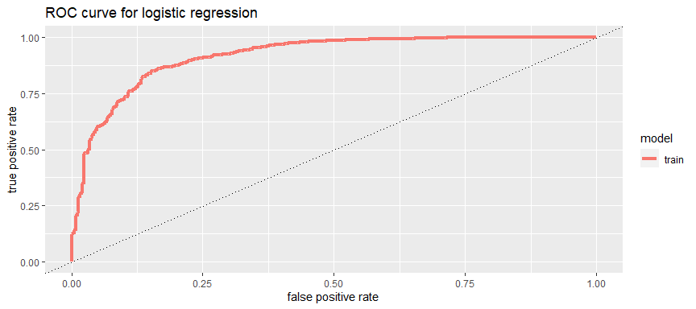

Team Project 2
================
Abizer and Luis
11/19/2022

In this project, we used the training data set to create a model that
predicts the county- level winner of the 2016 Presidential Election. The
winner of each county is classified as Democrat (Clinton) and Republican
(Rep)

We were concerned that there would be NA values in the “winner16”
variable. To remove the NAs, we created a new variable called “winner”
that omits the NA values. “Winner” variable is classified as Democrat if
the actual winner is “Dem” and Republican if the actual winner is “Rep”.
For example, some of the winner variable values are shown below

    [1] Republican Republican Republican Republican Democrat   Republican
    Levels: Democrat Republican

The fun part was deciding the variables we wanted to use in order to
create our model. We ran a regression analysis with the 51 predictor
variables and deciphered that 17 of them were significant. However, we
wanted to avoid overfitting hence we ran a regression analysis with
these 17 variables against the winner variable and chose only those
variables that had a significance level less than 0.0001. We were also
concerned that some of these variables might be correlated to each other
which might be affecting their significance level. To examine this, we
ran a individual regression analysis for each variable against the
winner variable and chose the ones that were still significant. After
doing this procedure, we concluded that retail sales, income/capita,
median house value, percentage of population living in multi unit
housing, languages other English spoken at home, percentage of
population who have completed undergraduate degree or higher, percentage
of population living in same housing for multiple years and percentage
change in population would be suitable for our model

The first summary table shows the significance level of all the 51
predictors and the second summary table shows the significance level of
the 8 predictors we chose

    Warning: glm.fit: fitted probabilities numerically 0 or 1 occurred

    Call:
    glm(formula = myform_initial, family = binomial, data = train_winner)

    Deviance Residuals: 
        Min       1Q   Median       3Q      Max  
    -3.2052   0.0346   0.0788   0.2088   3.2891  

    Coefficients:
                  Estimate Std. Error z value Pr(>|z|)    
    (Intercept)  1.513e+01  1.383e+02   0.109 0.912861    
    PST045214   -2.543e-05  2.295e-05  -1.108 0.267880    
    PST040210   -1.031e-04  8.880e-04  -0.116 0.907591    
    PST120214    1.148e-01  4.323e-02   2.656 0.007898 ** 
    POP010210    1.294e-04  8.864e-04   0.146 0.883942    
    AGE135214   -1.809e-01  2.273e-01  -0.796 0.426018    
    AGE295214    2.964e-01  9.522e-02   3.113 0.001854 ** 
    AGE775214    2.371e-01  5.748e-02   4.124 3.72e-05 ***
    SEX255214   -8.858e-02  6.091e-02  -1.454 0.145877    
    RHI125214   -1.436e-01  1.388e+00  -0.103 0.917587    
    RHI225214   -1.176e-01  1.382e+00  -0.085 0.932149    
    RHI325214   -1.241e-01  1.381e+00  -0.090 0.928403    
    RHI425214   -1.486e-01  1.380e+00  -0.108 0.914288    
    RHI525214   -2.802e-01  1.476e+00  -0.190 0.849402    
    RHI625214   -6.328e-02  1.392e+00  -0.045 0.963727    
    RHI725214    7.897e-02  1.505e-01   0.525 0.599840    
    RHI825214    1.544e-01  1.650e-01   0.936 0.349357    
    POP715213   -1.193e-01  3.585e-02  -3.328 0.000874 ***
    POP645213    3.114e-02  4.757e-02   0.655 0.512715    
    POP815213   -9.393e-02  3.287e-02  -2.858 0.004269 ** 
    EDU635213   -1.246e-01  3.887e-02  -3.206 0.001348 ** 
    EDU685213   -1.071e-01  3.098e-02  -3.458 0.000545 ***
    VET605213    5.160e-05  3.486e-05   1.480 0.138767    
    LFE305213   -2.738e-02  3.154e-02  -0.868 0.385260    
    HSG010214    2.601e-05  1.887e-05   1.378 0.168065    
    HSG445213   -2.419e-02  2.905e-02  -0.833 0.404934    
    HSG096213   -5.629e-02  2.436e-02  -2.310 0.020870 *  
    HSG495213   -1.834e-05  3.266e-06  -5.617 1.95e-08 ***
    HSD410213   -5.104e-05  3.210e-05  -1.590 0.111860    
    HSD310213    3.255e+00  1.046e+00   3.111 0.001863 ** 
    INC910213    1.454e-04  7.198e-05   2.020 0.043344 *  
    INC110213    5.421e-05  3.439e-05   1.576 0.114962    
    PVY020213    1.909e-03  3.660e-02   0.052 0.958416    
    BZA010213    4.938e-05  2.444e-04   0.202 0.839907    
    BZA110213    6.572e-07  8.910e-06   0.074 0.941203    
    BZA115213   -6.175e-03  1.915e-02  -0.322 0.747132    
    NES010213    1.633e-04  9.637e-05   1.694 0.090196 .  
    SBO001207   -1.535e-04  1.170e-04  -1.312 0.189477    
    SBO315207   -1.695e-02  1.501e-02  -1.129 0.258870    
    SBO115207   -1.597e-02  3.592e-02  -0.445 0.656655    
    SBO215207   -5.215e-02  9.353e-02  -0.558 0.577119    
    SBO515207   -2.185e+00  2.905e+00  -0.752 0.451924    
    SBO415207   -3.656e-02  1.944e-02  -1.881 0.060036 .  
    SBO015207   -9.850e-03  1.068e-02  -0.922 0.356492    
    MAN450207   -1.690e-08  3.531e-08  -0.479 0.632118    
    WTN220207   -2.509e-08  4.180e-08  -0.600 0.548381    
    RTN130207    3.493e-07  1.740e-07   2.007 0.044782 *  
    RTN131207   -2.952e-05  2.390e-05  -1.235 0.216778    
    AFN120207   -1.367e-06  7.475e-07  -1.829 0.067364 .  
    BPS030214    4.376e-04  2.388e-04   1.833 0.066844 .  
    LND110210    2.073e-04  8.507e-05   2.437 0.014811 *  
    POP060210    3.339e-04  2.632e-04   1.268 0.204640    
    ---
    Signif. codes:  0 '***' 0.001 '**' 0.01 '*' 0.05 '.' 0.1 ' ' 1

    (Dispersion parameter for binomial family taken to be 1)

        Null deviance: 2120.31  on 2488  degrees of freedom
    Residual deviance:  742.44  on 2437  degrees of freedom
    AIC: 846.44

    Number of Fisher Scoring iterations: 8

    Call:
    glm(formula = myform, family = binomial, data = train_final)

    Deviance Residuals: 
        Min       1Q   Median       3Q      Max  
    -3.0933   0.1303   0.2326   0.3772   3.5282  

    Coefficients:
                                                  Estimate Std. Error z value
    (Intercept)                                  1.222e+01  1.898e+00   6.437
    Retail_Sales_07                             -1.269e-07  3.098e-08  -4.096
    Income_per_capita                            3.667e-04  3.104e-05  11.816
    Median_house_value                          -1.412e-05  1.785e-06  -7.914
    Percent_multi_unit_housing                  -1.205e-01  1.284e-02  -9.380
    Spoken_non_english_lang                     -4.910e-02  6.285e-03  -7.813
    Percent_Undergrad                           -1.831e-01  1.736e-02 -10.543
    Percent_living_in_same_house_multiple_years -1.243e-01  2.182e-02  -5.694
    percent_change_in_pop                        1.713e-01  2.512e-02   6.818
                                                Pr(>|z|)    
    (Intercept)                                 1.22e-10 ***
    Retail_Sales_07                             4.21e-05 ***
    Income_per_capita                            < 2e-16 ***
    Median_house_value                          2.50e-15 ***
    Percent_multi_unit_housing                   < 2e-16 ***
    Spoken_non_english_lang                     5.58e-15 ***
    Percent_Undergrad                            < 2e-16 ***
    Percent_living_in_same_house_multiple_years 1.24e-08 ***
    percent_change_in_pop                       9.23e-12 ***
    ---
    Signif. codes:  0 '***' 0.001 '**' 0.01 '*' 0.05 '.' 0.1 ' ' 1

    (Dispersion parameter for binomial family taken to be 1)

        Null deviance: 2120.3  on 2488  degrees of freedom
    Residual deviance: 1183.0  on 2480  degrees of freedom
    AIC: 1201

    Number of Fisher Scoring iterations: 6

We then fit the model “winner.glm” into the train and test data to
create probabilities. We then set a threshold of 0.05. For example, if
the model determines the probability to be 0.1, prediction will be
Republican or else Democrat. Then, we created a double density curve

<!-- -->

The double density curve indicates that most Republicans have an
estimated probability of winning around 90%. Probability of Democrats
winning is not defined so well but range lower than a Republican

Here, we created a ROC curve for the training data

    Warning: `data_frame()` was deprecated in tibble 1.1.0.
    Please use `tibble()` instead.
    This warning is displayed once every 8 hours.
    Call `lifecycle::last_lifecycle_warnings()` to see where this warning was generated.

<!-- -->

The ROC curve shows the true positive and false positive rate of our
model. ROC curve suggests that our model is very good because it is
close to a right angled triangle and has a higher sensitivity than a
random classifier.

We then calculated the accuracy, precision and recall and the error of
the model using a 5-fold cross validation and a 0.05 threshold

       accuracy precision    recall
    1 0.8750502 0.8725166 0.9985789
    [1] 0.1257533

The accuracy for the logistic regression model is 0.875. The error is
0.126

Random Forest

We then created a random forest model called winner_rforest with 400
trees that randomly select out of 4 variables at each split. To choose
the number of bootstrapped trees and the number of predictors to
randomly select, we tried numbers around 400 and 4 respectively. We
noticed that the accuracy goes down if we input more/less predictors or
more/less trees hence we decided to stick with 400 trees and 4
predictors to randomly select. Then we fitted the model to the training
data, and calculated the accuracy, precision, recall and error for the
training data predictions.

    Call:
     randomForest(formula = myform, data = train_final, ntree = 400,      mtry = 4) 
                   Type of random forest: classification
                         Number of trees: 400
    No. of variables tried at each split: 4

            OOB estimate of  error rate: 9%
    Confusion matrix:
               Democrat Republican class.error
    Democrat        225        153  0.40476190
    Republican       71       2040  0.03363335
      accuracy precision    recall      error
    1 0.910004 0.9302326 0.9663667 0.08999598

Our accuracy was 0.91 and error was 0.09.

After running the two models, it was clear that the random forest model
gave us the highest accuracy of 0.91 and lowest error of 0.09 so we went
ahead with that model for our predictions.
